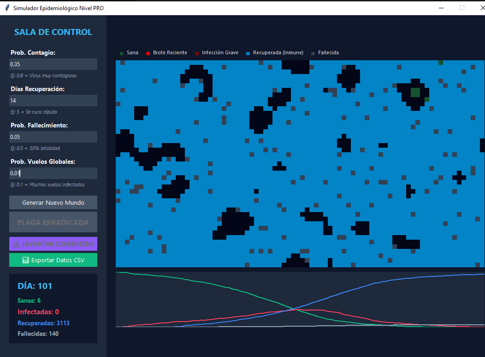

# Simulación de Autómatas Celulares: El Juego de la Vida de Conway

## Objetivo del Proyecto
Este proyecto es una simulación de sistemas basada en el Juego de la Vida de Conway utilizando autómatas celulares. Modela la evolución de una población en una cuadrícula bidimensional a lo largo del tiempo, aplicando reglas de transición locales y vecindad de Moore.

## Reglas de Transición
Cada celda evalúa su estado actual y el de sus 8 vecinas para decidir su próximo estado:
1. Nacimiento: Una célula muerta con exactamente 3 vecinas vivas nace.
2. Supervivencia: Una célula viva con 2 o 3 vecinas vivas sobrevive.
3. Muerte por soledad: Una célula viva con menos de 2 vecinas vivas muere.
4. Muerte por sobrepoblación: Una célula viva con más de 3 vecinas vivas muere.

*Nota visual:* El sistema incluye un rastreador de "edad celular", donde el color de la célula cambia según las generaciones que ha logrado sobrevivir.

## Interfaz del Proyecto

## Instrucciones de Instalación
1. Clonar este repositorio en tu máquina local.
2. Asegurarse de tener Python 3.x instalado.
3. No se requiere instalación de librerías de terceros (ver `requirements.txt`).

## Instrucciones de Ejecución
1. Abrir una terminal y navegar hasta el directorio raíz del proyecto.
2. Entrar a la carpeta del código fuente: `cd src`.
3. Ejecutar el archivo principal: `python main.py`.

## Librerías Utilizadas
* **tkinter:** Para la creación de la Interfaz Gráfica de Usuario (GUI) y el renderizado de la cuadrícula.
* **random:** Para la distribución inicial aleatoria de la población en la matriz.